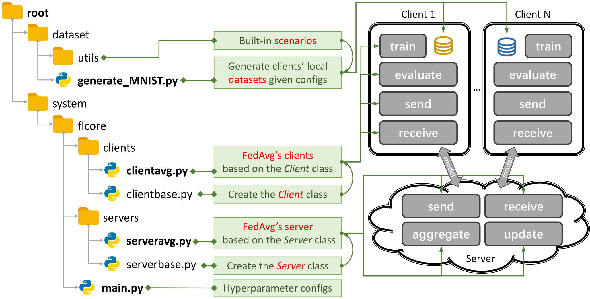

# FOUL: Computation and Communication Efficient Federated Unlearning via On-server Gradient Conflict Mitigation and Expression

<div align="center">

[](https://cvpr.thecvf.com/)
[](https://www.python.org/)
[](https://www.gnu.org/licenses/old-licenses/gpl-2.0.en.html)
[](https://github.com/skydvn/FOUL/stargazers)

**[Paper](#) | [Project Page](#) | [BibTeX](#citation)**

</div>

---

## 📖 Overview

**FOUL** (**F**ederated **U**n**l**earning via **O**n-server Gradient Conflict Mitigation and **E**xpression) is a novel federated unlearning framework that addresses the "right to be forgotten" problem in federated learning (FL) systems — without incurring the full cost of retraining from scratch.

Standard federated unlearning approaches require either full model retraining or heavy client-side computation, making them impractical at scale. FOUL decouples the unlearning burden from clients entirely by resolving **gradient conflicts on the server side**, dramatically reducing both communication overhead and computational cost while preserving model performance on remaining clients.

<div align="center">
  
  <p><em>Overview of the FOUL framework architecture.</em></p>
</div>

---

## ✨ Key Contributions

- **On-server Gradient Conflict Mitigation:** Identifies and resolves conflicts between the gradients of data to be forgotten and data to be retained — all on the server, without requiring clients to participate in the unlearning round.
- **Communication Efficiency:** Clients send updates only once; no additional unlearning rounds are pushed back to clients, slashing communication rounds compared to prior work.
- **Computation Efficiency:** Eliminates costly client-side retraining or fine-tuning, making FOUL scalable to large federated networks.
- **Flexible Unlearning Granularity:** Supports client-wise, class-wise, and domain-wise unlearning (e.g., selective domain removal in PACS).
- **Strong Empirical Performance:** Achieves unlearning efficacy comparable to exact retraining while maintaining high accuracy on retained data.

---

## 🏗️ Repository Structure

```
FOUL/
├── baselines/          # Competing federated unlearning methods
├── dataset/            # Dataset loading and preprocessing utilities
├── results/            # Experiment output logs and metrics
├── system/             # Core FOUL implementation
│   └── main.py         # Main training and unlearning entry point
├── splits.zip          # Pre-generated data splits
├── structure.png       # Framework architecture diagram
├── requirements.txt    # Python dependencies
└── env_cuda_latest.yaml  # Conda environment specification
```

---

## 🛠️ Installation

### Prerequisites

- Python 3.8+
- CUDA-compatible GPU (recommend)

### Option 1: Conda (Recommended)

```bash
git clone https://github.com/skydvn/FOUL.git
cd FOUL
conda env create -f env_cuda_latest.yaml
conda activate foul
```

### Option 2: pip

```bash
git clone https://github.com/skydvn/FOUL.git
cd FOUL
pip install -r requirements.txt
```

---

## 📂 Dataset Preparation

### PACS (Multi-Domain)

PACS contains images across four domains: **Photo, Art Painting, Cartoon, Sketch**. In FOUL, clients are allocated based on domain-specific segmentation, enabling selective domain unlearning.

To generate IID and balanced data splits across clients:

```bash
python generate_PACS1.py iid balance -
```

> Pre-generated splits are also Can wavailable in `splits.zip`.

---

## 🚀 Running Experiments

All experiment commands are run from the `system/` directory:

```bash
cd system/
```

### 1. Train the Global Model (FedAvg)

```bash
python main.py --learn False --learn_round 50
```

### 2. Run FOUL Unlearning

```bash
python main.py --learn unlearn --learn_round 50 --algo FOUL
```

---

## 🔬 Baseline Methods

### Naive Retraining (Exact Unlearning Baseline)

Full retraining from scratch on retained clients — the gold standard for unlearning efficacy.

```bash
python main.py --learn joint -gr 150 --learn_round 100 \
               --algo Retrain --local_epochs 2 -lbs 32 --log
```

### FOUL (Ours)

```bash
python main.py --learn joint -gr 150 --learn_round 100 \
               --algo FOUL --local_epochs 2 -lbs 32 \
               --beta_foul 3.5 --log
```

### FUSED

```bash
python main.py -data PACS -m CNN -algo FUSED \
               -gr 20 -ls 3 -lr 0.01 \
               -nc 20 -nb 7 \
               -ncl 6 -sr 0.9 \
               -ut domain -ud 0 \
               -lm learn -lrnd 15 \
               -wb \
               -did 0
```

---

## ⚙️ Key Arguments

| Argument | Description | Default |
|---|---|---|
| `--algo` | Algorithm to run (`FOUL`, `Retrain`, `FUSED`, `FedAvg`) | `FedAvg` |
| `--learn` | Learning mode (`False`, `unlearn`, `joint`) | `False` |
| `--learn_round` / `-lrnd` | Number of unlearning rounds | `50` |
| `-gr` | Total global communication rounds | `150` |
| `--local_epochs` / `-ls` | Local training epochs per client | `3` |
| `-lbs` | Local batch size | `32` |
| `-lr` | Learning rate | `0.01` |
| `-nc` | Number of clients | `20` |
| `--beta_foul` | FOUL gradient conflict mitigation coefficient | `3.5` |
| `-data` | Dataset name (e.g., `PACS`) | — |
| `-m` | Model architecture (e.g., `CNN`) | — |
| `-ut` | Unlearning type (`domain`, `client`, `class`) | — |
| `-ud` | Unlearning target ID | `0` |
| `--log` | Enable logging | `False` |
| `-wb` | Enable Weights & Biases logging | `False` |
| `-did` | CUDA device ID | `0` |

---

## 📊 Results

FOUL achieves unlearning performance on par with full retraining while reducing communication rounds and eliminating client-side unlearning computation. Detailed results across datasets, unlearning granularities, and baselines are available in the `results/` directory and in our CVPR 2026 paper.

---

## 📄 Citation

If you find this work useful, please cite our paper:

```bibtex
@inproceedings{foul2026cvpr,
  title     = {Computation and Communication Efficient Federated Unlearning via On-server Gradient Conflict Mitigation and Expression},
  booktitle = {Proceedings of the IEEE/CVF Conference on Computer Vision and Pattern Recognition (CVPR)},
  year      = {2026}
}
```

---

## 📜 License

This project is licensed under the [GNU General Public License v2.0](LICENSE).

---

## 🙏 Acknowledgements

This codebase builds upon [PFLlib](https://github.com/TsingZ0/PFLlib). We thank the authors for their excellent open-source contribution to the federated learning community.

---

<div align="center">
  <sub>⭐ If you find FOUL useful, please consider starring this repository!</sub>
</div>
